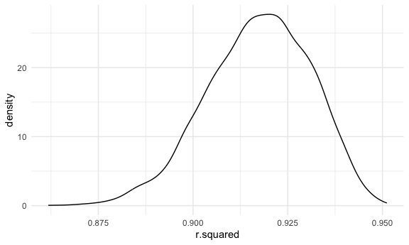
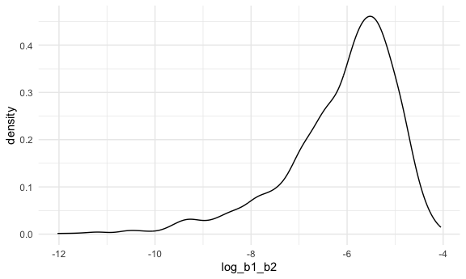

P8105 HW6
================
Courtney Diamond
2023-11-28

## Problem 1

``` r
homicide_data = 
  read_csv("data/homicide-data.csv") |> 
  mutate(city_state = str_c(as.character(city), as.character(state), sep = ", ")) |> 
  filter(!city_state %in% c('Tulsa, AL', 'Dallas, TX', 'Phoenix, AZ', 'Kansas City, MO')) |> 
  filter(victim_race %in% c('White', 'Black')) |> 
  mutate(victim_age = as.numeric(victim_age)) |> 
  mutate(status = as.numeric(disposition == 'Closed by arrest'))
```

    ## Rows: 52179 Columns: 12
    ## ── Column specification ────────────────────────────────────────────────────────
    ## Delimiter: ","
    ## chr (9): uid, victim_last, victim_first, victim_race, victim_age, victim_sex...
    ## dbl (3): reported_date, lat, lon
    ## 
    ## ℹ Use `spec()` to retrieve the full column specification for this data.
    ## ℹ Specify the column types or set `show_col_types = FALSE` to quiet this message.

    ## Warning: There was 1 warning in `mutate()`.
    ## ℹ In argument: `victim_age = as.numeric(victim_age)`.
    ## Caused by warning:
    ## ! NAs introduced by coercion

``` r
homicide_data
```

    ## # A tibble: 39,693 × 14
    ##    uid        reported_date victim_last  victim_first victim_race victim_age
    ##    <chr>              <dbl> <chr>        <chr>        <chr>            <dbl>
    ##  1 Alb-000003      20100601 SATTERFIELD  VIVIANA      White               15
    ##  2 Alb-000005      20100102 MULA         VIVIAN       White               72
    ##  3 Alb-000006      20100126 BOOK         GERALDINE    White               91
    ##  4 Alb-000009      20100130 MARTIN-LEYVA GUSTAVO      White               56
    ##  5 Alb-000012      20100218 LUJAN        KEVIN        White               NA
    ##  6 Alb-000016      20100308 GRAY         STEFANIA     White               43
    ##  7 Alb-000018      20100323 DAVID        LARRY        White               52
    ##  8 Alb-000019      20100402 BRITO        ELIZABETH    White               22
    ##  9 Alb-000021      20100423 KING         TEVION       Black               15
    ## 10 Alb-000022      20100423 BOYKIN       CEDRIC       Black               25
    ## # ℹ 39,683 more rows
    ## # ℹ 8 more variables: victim_sex <chr>, city <chr>, state <chr>, lat <dbl>,
    ## #   lon <dbl>, disposition <chr>, city_state <chr>, status <dbl>

First let’s narrow down to Baltimore, MD

``` r
baltimore_homicide_df = 
  homicide_data |> 
  filter(city_state == 'Baltimore, MD')

baltimore_homicide_df
```

    ## # A tibble: 2,753 × 14
    ##    uid        reported_date victim_last victim_first  victim_race victim_age
    ##    <chr>              <dbl> <chr>       <chr>         <chr>            <dbl>
    ##  1 Bal-001607      20070101 NELSON      LEON          Black               17
    ##  2 Bal-001608      20070102 GOLF        EDDIE         Black               26
    ##  3 Bal-001609      20070105 MACKENNEY   THOMAS JOSEPH Black               21
    ##  4 Bal-001610      20070105 CANUPP      EDWARD LEE    White               61
    ##  5 Bal-001611      20070106 CUNNINGHAN  MICHAEL       Black               46
    ##  6 Bal-001612      20070106 ALSTON      RAY WILLIAM   Black               27
    ##  7 Bal-001613      20070107 HENDERSON   YULE ANTONIO  Black               21
    ##  8 Bal-001614      20070108 MCDOWELL    MARCU         Black               16
    ##  9 Bal-001615      20070108 GARDNER     RODNEY THOMAS Black               21
    ## 10 Bal-001616      20070108 BURNETTE    NELSENE       Black               44
    ## # ℹ 2,743 more rows
    ## # ℹ 8 more variables: victim_sex <chr>, city <chr>, state <chr>, lat <dbl>,
    ## #   lon <dbl>, disposition <chr>, city_state <chr>, status <dbl>

Now let’s run the glm!

``` r
baltimore_fit = 
  baltimore_homicide_df |> 
  glm(status ~ victim_age + victim_race + victim_sex, data = _, family = binomial()) |> 
  broom::tidy() |> 
  mutate(OR = exp(estimate),
         OR_CI_upper = exp(estimate + 1.96 * std.error),
         OR_CI_lower = exp(estimate - 1.96 * std.error)) |> 
  select(term, OR, OR_CI_upper, OR_CI_lower, p.value) |> 
  filter(term == 'victim_sexMale') |> 
  knitr::kable()

  
baltimore_fit
```

| term           |        OR | OR_CI_upper | OR_CI_lower | p.value |
|:---------------|----------:|------------:|------------:|--------:|
| victim_sexMale | 0.4255117 |   0.5578655 |    0.324559 |       0 |

Keeping all other variables fixed, the odds of a homicide being solved
for male victims are lower than for female victims.

Now, let’s transform this to a pipeline to do the same sort of
calculation for all the cities in the original dataset.

``` r
male_odds_solved =   
  homicide_data |> 
  nest(data = -city_state) |> 
  mutate(
    models = map(data, \(df) glm(status ~ victim_age + victim_race + victim_sex, data = df, family = binomial())),
    ) |> 
  mutate(
    tidy_models = map(models, broom::tidy)
    ) |> 
  unnest(tidy_models) |> 
  mutate(
    OR = exp(estimate),
    upper_OR_CI = exp(estimate + 1.96 * std.error),
    lower_OR_CI = exp(estimate - 1.96 * std.error)
  ) |> 
  select(city_state, term, OR, upper_OR_CI, lower_OR_CI, p.value) |> 
  filter(term == 'victim_sexMale')

male_odds_solved |> 
  knitr::kable(digits = 3)
```

| city_state         | term           |    OR | upper_OR_CI | lower_OR_CI | p.value |
|:-------------------|:---------------|------:|------------:|------------:|--------:|
| Albuquerque, NM    | victim_sexMale | 1.767 |       3.761 |       0.831 |   0.139 |
| Atlanta, GA        | victim_sexMale | 1.000 |       1.463 |       0.684 |   1.000 |
| Baltimore, MD      | victim_sexMale | 0.426 |       0.558 |       0.325 |   0.000 |
| Baton Rouge, LA    | victim_sexMale | 0.381 |       0.695 |       0.209 |   0.002 |
| Birmingham, AL     | victim_sexMale | 0.870 |       1.318 |       0.574 |   0.511 |
| Boston, MA         | victim_sexMale | 0.674 |       1.276 |       0.356 |   0.226 |
| Buffalo, NY        | victim_sexMale | 0.521 |       0.935 |       0.290 |   0.029 |
| Charlotte, NC      | victim_sexMale | 0.884 |       1.403 |       0.557 |   0.600 |
| Chicago, IL        | victim_sexMale | 0.410 |       0.501 |       0.336 |   0.000 |
| Cincinnati, OH     | victim_sexMale | 0.400 |       0.677 |       0.236 |   0.001 |
| Columbus, OH       | victim_sexMale | 0.532 |       0.750 |       0.378 |   0.000 |
| Denver, CO         | victim_sexMale | 0.479 |       0.971 |       0.236 |   0.041 |
| Detroit, MI        | victim_sexMale | 0.582 |       0.734 |       0.462 |   0.000 |
| Durham, NC         | victim_sexMale | 0.812 |       1.683 |       0.392 |   0.576 |
| Fort Worth, TX     | victim_sexMale | 0.669 |       1.127 |       0.397 |   0.131 |
| Fresno, CA         | victim_sexMale | 1.335 |       3.071 |       0.580 |   0.496 |
| Houston, TX        | victim_sexMale | 0.711 |       0.907 |       0.558 |   0.006 |
| Indianapolis, IN   | victim_sexMale | 0.919 |       1.242 |       0.679 |   0.582 |
| Jacksonville, FL   | victim_sexMale | 0.720 |       0.966 |       0.537 |   0.028 |
| Las Vegas, NV      | victim_sexMale | 0.837 |       1.154 |       0.608 |   0.278 |
| Long Beach, CA     | victim_sexMale | 0.410 |       1.082 |       0.156 |   0.072 |
| Los Angeles, CA    | victim_sexMale | 0.662 |       0.956 |       0.458 |   0.028 |
| Louisville, KY     | victim_sexMale | 0.491 |       0.790 |       0.305 |   0.003 |
| Memphis, TN        | victim_sexMale | 0.723 |       0.988 |       0.529 |   0.042 |
| Miami, FL          | victim_sexMale | 0.515 |       0.872 |       0.304 |   0.013 |
| Milwaukee, wI      | victim_sexMale | 0.727 |       1.060 |       0.499 |   0.098 |
| Minneapolis, MN    | victim_sexMale | 0.947 |       1.875 |       0.478 |   0.876 |
| Nashville, TN      | victim_sexMale | 1.034 |       1.562 |       0.685 |   0.873 |
| New Orleans, LA    | victim_sexMale | 0.585 |       0.811 |       0.422 |   0.001 |
| New York, NY       | victim_sexMale | 0.262 |       0.499 |       0.138 |   0.000 |
| Oakland, CA        | victim_sexMale | 0.563 |       0.868 |       0.365 |   0.009 |
| Oklahoma City, OK  | victim_sexMale | 0.974 |       1.520 |       0.624 |   0.908 |
| Omaha, NE          | victim_sexMale | 0.382 |       0.721 |       0.203 |   0.003 |
| Philadelphia, PA   | victim_sexMale | 0.496 |       0.652 |       0.378 |   0.000 |
| Pittsburgh, PA     | victim_sexMale | 0.431 |       0.700 |       0.265 |   0.001 |
| Richmond, VA       | victim_sexMale | 1.006 |       2.033 |       0.498 |   0.987 |
| San Antonio, TX    | victim_sexMale | 0.705 |       1.249 |       0.398 |   0.230 |
| Sacramento, CA     | victim_sexMale | 0.669 |       1.337 |       0.335 |   0.255 |
| Savannah, GA       | victim_sexMale | 0.867 |       1.780 |       0.422 |   0.697 |
| San Bernardino, CA | victim_sexMale | 0.500 |       1.462 |       0.171 |   0.206 |
| San Diego, CA      | victim_sexMale | 0.413 |       0.855 |       0.200 |   0.017 |
| San Francisco, CA  | victim_sexMale | 0.608 |       1.165 |       0.317 |   0.134 |
| St. Louis, MO      | victim_sexMale | 0.703 |       0.932 |       0.530 |   0.014 |
| Stockton, CA       | victim_sexMale | 1.352 |       2.942 |       0.621 |   0.447 |
| Tampa, FL          | victim_sexMale | 0.808 |       1.876 |       0.348 |   0.619 |
| Tulsa, OK          | victim_sexMale | 0.976 |       1.552 |       0.614 |   0.917 |
| Washington, DC     | victim_sexMale | 0.690 |       1.017 |       0.468 |   0.061 |

``` r
male_odds_solved |> 
  mutate(city_state = fct_reorder(city_state, OR)) |> 
  ggplot(aes(x = city_state, y = OR)) + 
  geom_point() + 
  geom_errorbar(aes(ymin = lower_OR_CI, ymax = upper_OR_CI)) + 
    theme(axis.text.x = element_text(angle = 60, hjust = 1))
```


Most of the cities plotted have ORs less than 1 after adjusting for race
and age, indicating smaller odds of a male victim’s homicide being
solved compared to females’. Nashville, TN, Fresno, CA, Stockton, CA,
and Albuquerque, NM have ORs greater than 1. 22 of the cities have
confidence intervals that do not include 1, indicating a statistically
significant result.

## Problem 2

First let’s load the data.

``` r
weather_df = 
  rnoaa::meteo_pull_monitors(
    c("USW00094728"),
    var = c("PRCP", "TMIN", "TMAX"), 
    date_min = "2022-01-01",
    date_max = "2022-12-31") |>
  mutate(
    name = recode(id, USW00094728 = "CentralPark_NY"),
    tmin = tmin / 10,
    tmax = tmax / 10) |>
  select(name, id, everything())
```

    ## using cached file: /Users/cjd2195/Library/Caches/org.R-project.R/R/rnoaa/noaa_ghcnd/USW00094728.dly

    ## date created (size, mb): 2023-10-05 10:29:35.021583 (8.527)

    ## file min/max dates: 1869-01-01 / 2023-10-31

``` r
weather_df
```

    ## # A tibble: 365 × 6
    ##    name           id          date        prcp  tmax  tmin
    ##    <chr>          <chr>       <date>     <dbl> <dbl> <dbl>
    ##  1 CentralPark_NY USW00094728 2022-01-01   201  13.3  10  
    ##  2 CentralPark_NY USW00094728 2022-01-02    10  15     2.8
    ##  3 CentralPark_NY USW00094728 2022-01-03     0   2.8  -5.5
    ##  4 CentralPark_NY USW00094728 2022-01-04     0   1.1  -7.1
    ##  5 CentralPark_NY USW00094728 2022-01-05    58   8.3  -0.5
    ##  6 CentralPark_NY USW00094728 2022-01-06     0   5     1.1
    ##  7 CentralPark_NY USW00094728 2022-01-07    97   1.1  -3.8
    ##  8 CentralPark_NY USW00094728 2022-01-08     0  -1    -6.6
    ##  9 CentralPark_NY USW00094728 2022-01-09    25   4.4  -1.6
    ## 10 CentralPark_NY USW00094728 2022-01-10     0   4.4  -4.3
    ## # ℹ 355 more rows

Now let’s make a quick function to actually take a single bootstrap
sample.

``` r
boot_sample = function(df) {
  
  sample_frac(df, replace = TRUE)
  
}
```

Great, now let’s build a pipeline to do this a few (thousand) times.
We’ll examine one of the strapped samples just to be safe.

``` r
boot_straps = 
  tibble(strap_number = 1:5000) |> 
  mutate(
    strap_sample = map(strap_number, \(i) boot_sample(weather_df))
  )

boot_straps |> 
  pull(strap_sample) |> 
  nth(1) |> 
  arrange(date) |> 
  knitr::kable()
```

| name           | id          | date       | prcp | tmax |  tmin |
|:---------------|:------------|:-----------|-----:|-----:|------:|
| CentralPark_NY | USW00094728 | 2022-01-01 |  201 | 13.3 |  10.0 |
| CentralPark_NY | USW00094728 | 2022-01-01 |  201 | 13.3 |  10.0 |
| CentralPark_NY | USW00094728 | 2022-01-02 |   10 | 15.0 |   2.8 |
| CentralPark_NY | USW00094728 | 2022-01-02 |   10 | 15.0 |   2.8 |
| CentralPark_NY | USW00094728 | 2022-01-06 |    0 |  5.0 |   1.1 |
| CentralPark_NY | USW00094728 | 2022-01-08 |    0 | -1.0 |  -6.6 |
| CentralPark_NY | USW00094728 | 2022-01-08 |    0 | -1.0 |  -6.6 |
| CentralPark_NY | USW00094728 | 2022-01-11 |    0 | -4.3 |  -9.3 |
| CentralPark_NY | USW00094728 | 2022-01-11 |    0 | -4.3 |  -9.3 |
| CentralPark_NY | USW00094728 | 2022-01-11 |    0 | -4.3 |  -9.3 |
| CentralPark_NY | USW00094728 | 2022-01-12 |    0 |  4.4 |  -6.6 |
| CentralPark_NY | USW00094728 | 2022-01-12 |    0 |  4.4 |  -6.6 |
| CentralPark_NY | USW00094728 | 2022-01-14 |    0 |  6.1 |  -6.0 |
| CentralPark_NY | USW00094728 | 2022-01-15 |    0 | -6.0 | -12.1 |
| CentralPark_NY | USW00094728 | 2022-01-16 |   94 |  2.8 | -12.1 |
| CentralPark_NY | USW00094728 | 2022-01-17 |  295 |  6.7 |   1.1 |
| CentralPark_NY | USW00094728 | 2022-01-18 |    0 |  2.2 |  -1.6 |
| CentralPark_NY | USW00094728 | 2022-01-19 |    0 |  9.4 |  -2.1 |
| CentralPark_NY | USW00094728 | 2022-01-19 |    0 |  9.4 |  -2.1 |
| CentralPark_NY | USW00094728 | 2022-01-19 |    0 |  9.4 |  -2.1 |
| CentralPark_NY | USW00094728 | 2022-01-21 |    0 | -5.5 |  -9.9 |
| CentralPark_NY | USW00094728 | 2022-01-23 |    5 |  2.8 |  -4.3 |
| CentralPark_NY | USW00094728 | 2022-01-23 |    5 |  2.8 |  -4.3 |
| CentralPark_NY | USW00094728 | 2022-01-24 |    0 |  2.2 |  -3.2 |
| CentralPark_NY | USW00094728 | 2022-01-26 |    0 | -2.1 |  -6.6 |
| CentralPark_NY | USW00094728 | 2022-01-26 |    0 | -2.1 |  -6.6 |
| CentralPark_NY | USW00094728 | 2022-01-27 |    0 |  0.0 |  -8.2 |
| CentralPark_NY | USW00094728 | 2022-01-28 |   33 |  0.0 |  -1.6 |
| CentralPark_NY | USW00094728 | 2022-01-29 |  196 | -1.6 | -11.0 |
| CentralPark_NY | USW00094728 | 2022-01-29 |  196 | -1.6 | -11.0 |
| CentralPark_NY | USW00094728 | 2022-01-30 |    0 | -3.2 | -11.0 |
| CentralPark_NY | USW00094728 | 2022-01-31 |    0 | -0.5 |  -6.0 |
| CentralPark_NY | USW00094728 | 2022-02-01 |    0 |  2.2 |  -4.9 |
| CentralPark_NY | USW00094728 | 2022-02-01 |    0 |  2.2 |  -4.9 |
| CentralPark_NY | USW00094728 | 2022-02-02 |    0 |  8.3 |   0.0 |
| CentralPark_NY | USW00094728 | 2022-02-02 |    0 |  8.3 |   0.0 |
| CentralPark_NY | USW00094728 | 2022-02-03 |  107 | 11.1 |   5.6 |
| CentralPark_NY | USW00094728 | 2022-02-03 |  107 | 11.1 |   5.6 |
| CentralPark_NY | USW00094728 | 2022-02-04 |  183 | 13.9 |  -3.2 |
| CentralPark_NY | USW00094728 | 2022-02-05 |    0 | -2.7 |  -7.1 |
| CentralPark_NY | USW00094728 | 2022-02-08 |   18 |  7.2 |   0.0 |
| CentralPark_NY | USW00094728 | 2022-02-08 |   18 |  7.2 |   0.0 |
| CentralPark_NY | USW00094728 | 2022-02-10 |    0 | 12.2 |   2.8 |
| CentralPark_NY | USW00094728 | 2022-02-13 |   58 |  5.6 |  -3.8 |
| CentralPark_NY | USW00094728 | 2022-02-14 |    0 | -3.8 |  -8.8 |
| CentralPark_NY | USW00094728 | 2022-02-14 |    0 | -3.8 |  -8.8 |
| CentralPark_NY | USW00094728 | 2022-02-15 |    0 | -1.0 |  -8.8 |
| CentralPark_NY | USW00094728 | 2022-02-20 |    0 |  2.2 |  -6.0 |
| CentralPark_NY | USW00094728 | 2022-02-20 |    0 |  2.2 |  -6.0 |
| CentralPark_NY | USW00094728 | 2022-02-21 |    0 | 12.8 |   0.0 |
| CentralPark_NY | USW00094728 | 2022-02-21 |    0 | 12.8 |   0.0 |
| CentralPark_NY | USW00094728 | 2022-02-22 |   66 | 16.1 |   2.8 |
| CentralPark_NY | USW00094728 | 2022-02-22 |   66 | 16.1 |   2.8 |
| CentralPark_NY | USW00094728 | 2022-02-23 |    0 | 20.0 |   1.7 |
| CentralPark_NY | USW00094728 | 2022-02-24 |    0 |  1.7 |  -1.6 |
| CentralPark_NY | USW00094728 | 2022-02-24 |    0 |  1.7 |  -1.6 |
| CentralPark_NY | USW00094728 | 2022-02-25 |  188 |  5.0 |  -3.2 |
| CentralPark_NY | USW00094728 | 2022-02-28 |    0 |  2.2 |  -3.2 |
| CentralPark_NY | USW00094728 | 2022-03-01 |    0 |  8.9 |  -0.5 |
| CentralPark_NY | USW00094728 | 2022-03-02 |    0 | 11.1 |   4.4 |
| CentralPark_NY | USW00094728 | 2022-03-02 |    0 | 11.1 |   4.4 |
| CentralPark_NY | USW00094728 | 2022-03-03 |    8 |  8.9 |  -4.3 |
| CentralPark_NY | USW00094728 | 2022-03-04 |    0 |  2.8 |  -6.0 |
| CentralPark_NY | USW00094728 | 2022-03-05 |    0 |  7.8 |   0.0 |
| CentralPark_NY | USW00094728 | 2022-03-05 |    0 |  7.8 |   0.0 |
| CentralPark_NY | USW00094728 | 2022-03-06 |   15 | 20.0 |   6.1 |
| CentralPark_NY | USW00094728 | 2022-03-07 |    8 | 23.3 |  10.0 |
| CentralPark_NY | USW00094728 | 2022-03-07 |    8 | 23.3 |  10.0 |
| CentralPark_NY | USW00094728 | 2022-03-08 |    0 | 10.0 |   3.9 |
| CentralPark_NY | USW00094728 | 2022-03-08 |    0 | 10.0 |   3.9 |
| CentralPark_NY | USW00094728 | 2022-03-08 |    0 | 10.0 |   3.9 |
| CentralPark_NY | USW00094728 | 2022-03-09 |  142 |  5.0 |   0.6 |
| CentralPark_NY | USW00094728 | 2022-03-12 |  127 |  8.9 |  -4.3 |
| CentralPark_NY | USW00094728 | 2022-03-12 |  127 |  8.9 |  -4.3 |
| CentralPark_NY | USW00094728 | 2022-03-12 |  127 |  8.9 |  -4.3 |
| CentralPark_NY | USW00094728 | 2022-03-13 |    0 |  1.7 |  -5.5 |
| CentralPark_NY | USW00094728 | 2022-03-14 |    0 | 13.3 |   0.6 |
| CentralPark_NY | USW00094728 | 2022-03-15 |    0 | 20.0 |   7.8 |
| CentralPark_NY | USW00094728 | 2022-03-16 |    0 | 19.4 |   8.9 |
| CentralPark_NY | USW00094728 | 2022-03-16 |    0 | 19.4 |   8.9 |
| CentralPark_NY | USW00094728 | 2022-03-22 |    0 | 14.4 |   6.1 |
| CentralPark_NY | USW00094728 | 2022-03-23 |   15 |  9.4 |   3.3 |
| CentralPark_NY | USW00094728 | 2022-03-23 |   15 |  9.4 |   3.3 |
| CentralPark_NY | USW00094728 | 2022-03-24 |  236 |  8.3 |   3.3 |
| CentralPark_NY | USW00094728 | 2022-03-24 |  236 |  8.3 |   3.3 |
| CentralPark_NY | USW00094728 | 2022-03-25 |    5 | 15.6 |   6.7 |
| CentralPark_NY | USW00094728 | 2022-03-25 |    5 | 15.6 |   6.7 |
| CentralPark_NY | USW00094728 | 2022-03-26 |    0 | 11.7 |   5.6 |
| CentralPark_NY | USW00094728 | 2022-03-27 |    0 |  7.8 |  -2.1 |
| CentralPark_NY | USW00094728 | 2022-03-27 |    0 |  7.8 |  -2.1 |
| CentralPark_NY | USW00094728 | 2022-03-27 |    0 |  7.8 |  -2.1 |
| CentralPark_NY | USW00094728 | 2022-03-28 |    0 |  0.6 |  -4.9 |
| CentralPark_NY | USW00094728 | 2022-03-28 |    0 |  0.6 |  -4.9 |
| CentralPark_NY | USW00094728 | 2022-03-29 |    0 |  3.3 |  -4.3 |
| CentralPark_NY | USW00094728 | 2022-03-29 |    0 |  3.3 |  -4.3 |
| CentralPark_NY | USW00094728 | 2022-03-31 |   18 | 18.9 |   7.2 |
| CentralPark_NY | USW00094728 | 2022-04-01 |   71 | 16.1 |   6.1 |
| CentralPark_NY | USW00094728 | 2022-04-01 |   71 | 16.1 |   6.1 |
| CentralPark_NY | USW00094728 | 2022-04-01 |   71 | 16.1 |   6.1 |
| CentralPark_NY | USW00094728 | 2022-04-02 |    0 | 12.2 |   3.3 |
| CentralPark_NY | USW00094728 | 2022-04-04 |    0 | 12.2 |   3.9 |
| CentralPark_NY | USW00094728 | 2022-04-06 |  114 | 11.7 |   6.7 |
| CentralPark_NY | USW00094728 | 2022-04-07 |  284 | 12.2 |   7.2 |
| CentralPark_NY | USW00094728 | 2022-04-07 |  284 | 12.2 |   7.2 |
| CentralPark_NY | USW00094728 | 2022-04-08 |    8 | 18.3 |   9.4 |
| CentralPark_NY | USW00094728 | 2022-04-08 |    8 | 18.3 |   9.4 |
| CentralPark_NY | USW00094728 | 2022-04-08 |    8 | 18.3 |   9.4 |
| CentralPark_NY | USW00094728 | 2022-04-09 |   13 | 12.8 |   8.3 |
| CentralPark_NY | USW00094728 | 2022-04-09 |   13 | 12.8 |   8.3 |
| CentralPark_NY | USW00094728 | 2022-04-12 |   18 | 22.2 |  10.0 |
| CentralPark_NY | USW00094728 | 2022-04-15 |    0 | 21.1 |  11.1 |
| CentralPark_NY | USW00094728 | 2022-04-16 |   51 | 22.8 |   6.7 |
| CentralPark_NY | USW00094728 | 2022-04-17 |    0 | 10.6 |   5.0 |
| CentralPark_NY | USW00094728 | 2022-04-17 |    0 | 10.6 |   5.0 |
| CentralPark_NY | USW00094728 | 2022-04-17 |    0 | 10.6 |   5.0 |
| CentralPark_NY | USW00094728 | 2022-04-19 |  315 | 10.0 |   3.9 |
| CentralPark_NY | USW00094728 | 2022-04-19 |  315 | 10.0 |   3.9 |
| CentralPark_NY | USW00094728 | 2022-04-22 |    0 | 21.1 |  11.7 |
| CentralPark_NY | USW00094728 | 2022-04-23 |    0 | 18.3 |  10.6 |
| CentralPark_NY | USW00094728 | 2022-04-24 |    0 | 17.2 |   8.9 |
| CentralPark_NY | USW00094728 | 2022-04-24 |    0 | 17.2 |   8.9 |
| CentralPark_NY | USW00094728 | 2022-04-25 |    0 | 14.4 |   7.8 |
| CentralPark_NY | USW00094728 | 2022-04-25 |    0 | 14.4 |   7.8 |
| CentralPark_NY | USW00094728 | 2022-04-26 |    5 | 15.6 |  11.1 |
| CentralPark_NY | USW00094728 | 2022-04-26 |    5 | 15.6 |  11.1 |
| CentralPark_NY | USW00094728 | 2022-04-26 |    5 | 15.6 |  11.1 |
| CentralPark_NY | USW00094728 | 2022-04-26 |    5 | 15.6 |  11.1 |
| CentralPark_NY | USW00094728 | 2022-04-27 |    0 | 14.4 |   5.0 |
| CentralPark_NY | USW00094728 | 2022-04-30 |    0 | 20.0 |   6.7 |
| CentralPark_NY | USW00094728 | 2022-04-30 |    0 | 20.0 |   6.7 |
| CentralPark_NY | USW00094728 | 2022-05-01 |    0 | 20.6 |   8.3 |
| CentralPark_NY | USW00094728 | 2022-05-01 |    0 | 20.6 |   8.3 |
| CentralPark_NY | USW00094728 | 2022-05-02 |   58 | 13.3 |  10.6 |
| CentralPark_NY | USW00094728 | 2022-05-02 |   58 | 13.3 |  10.6 |
| CentralPark_NY | USW00094728 | 2022-05-02 |   58 | 13.3 |  10.6 |
| CentralPark_NY | USW00094728 | 2022-05-02 |   58 | 13.3 |  10.6 |
| CentralPark_NY | USW00094728 | 2022-05-04 |   20 | 18.3 |  10.0 |
| CentralPark_NY | USW00094728 | 2022-05-04 |   20 | 18.3 |  10.0 |
| CentralPark_NY | USW00094728 | 2022-05-04 |   20 | 18.3 |  10.0 |
| CentralPark_NY | USW00094728 | 2022-05-05 |    0 | 23.3 |  13.3 |
| CentralPark_NY | USW00094728 | 2022-05-06 |  175 | 16.1 |   9.4 |
| CentralPark_NY | USW00094728 | 2022-05-07 |  234 | 10.0 |   7.2 |
| CentralPark_NY | USW00094728 | 2022-05-07 |  234 | 10.0 |   7.2 |
| CentralPark_NY | USW00094728 | 2022-05-07 |  234 | 10.0 |   7.2 |
| CentralPark_NY | USW00094728 | 2022-05-08 |    0 | 14.4 |   7.2 |
| CentralPark_NY | USW00094728 | 2022-05-09 |    0 | 21.1 |   8.3 |
| CentralPark_NY | USW00094728 | 2022-05-10 |    0 | 22.8 |  10.6 |
| CentralPark_NY | USW00094728 | 2022-05-10 |    0 | 22.8 |  10.6 |
| CentralPark_NY | USW00094728 | 2022-05-11 |    0 | 23.9 |  11.7 |
| CentralPark_NY | USW00094728 | 2022-05-15 |   25 | 24.4 |  15.6 |
| CentralPark_NY | USW00094728 | 2022-05-16 |   30 | 23.9 |  16.1 |
| CentralPark_NY | USW00094728 | 2022-05-21 |    0 | 32.2 |  16.7 |
| CentralPark_NY | USW00094728 | 2022-05-22 |    0 | 31.7 |  22.2 |
| CentralPark_NY | USW00094728 | 2022-05-22 |    0 | 31.7 |  22.2 |
| CentralPark_NY | USW00094728 | 2022-05-24 |    0 | 19.4 |  13.9 |
| CentralPark_NY | USW00094728 | 2022-05-28 |  183 | 23.3 |  17.2 |
| CentralPark_NY | USW00094728 | 2022-05-28 |  183 | 23.3 |  17.2 |
| CentralPark_NY | USW00094728 | 2022-05-29 |    0 | 25.0 |  15.0 |
| CentralPark_NY | USW00094728 | 2022-05-31 |    0 | 33.9 |  18.3 |
| CentralPark_NY | USW00094728 | 2022-06-01 |  180 | 22.2 |  15.6 |
| CentralPark_NY | USW00094728 | 2022-06-01 |  180 | 22.2 |  15.6 |
| CentralPark_NY | USW00094728 | 2022-06-02 |  114 | 26.1 |  16.7 |
| CentralPark_NY | USW00094728 | 2022-06-02 |  114 | 26.1 |  16.7 |
| CentralPark_NY | USW00094728 | 2022-06-03 |    0 | 24.4 |  16.7 |
| CentralPark_NY | USW00094728 | 2022-06-06 |    0 | 26.7 |  17.2 |
| CentralPark_NY | USW00094728 | 2022-06-07 |   20 | 25.6 |  17.2 |
| CentralPark_NY | USW00094728 | 2022-06-10 |    0 | 25.0 |  17.2 |
| CentralPark_NY | USW00094728 | 2022-06-11 |    0 | 23.3 |  18.9 |
| CentralPark_NY | USW00094728 | 2022-06-12 |   13 | 22.2 |  17.2 |
| CentralPark_NY | USW00094728 | 2022-06-13 |    0 | 29.4 |  20.0 |
| CentralPark_NY | USW00094728 | 2022-06-14 |    0 | 27.2 |  20.0 |
| CentralPark_NY | USW00094728 | 2022-06-15 |    0 | 28.3 |  18.9 |
| CentralPark_NY | USW00094728 | 2022-06-16 |   81 | 21.7 |  16.1 |
| CentralPark_NY | USW00094728 | 2022-06-16 |   81 | 21.7 |  16.1 |
| CentralPark_NY | USW00094728 | 2022-06-17 |    0 | 31.1 |  20.6 |
| CentralPark_NY | USW00094728 | 2022-06-18 |    0 | 23.9 |  14.4 |
| CentralPark_NY | USW00094728 | 2022-06-18 |    0 | 23.9 |  14.4 |
| CentralPark_NY | USW00094728 | 2022-06-19 |    0 | 22.8 |  12.2 |
| CentralPark_NY | USW00094728 | 2022-06-19 |    0 | 22.8 |  12.2 |
| CentralPark_NY | USW00094728 | 2022-06-20 |    0 | 25.6 |  13.9 |
| CentralPark_NY | USW00094728 | 2022-06-21 |   15 | 26.7 |  17.2 |
| CentralPark_NY | USW00094728 | 2022-06-24 |    0 | 27.2 |  17.2 |
| CentralPark_NY | USW00094728 | 2022-06-27 |   74 | 25.0 |  20.6 |
| CentralPark_NY | USW00094728 | 2022-06-27 |   74 | 25.0 |  20.6 |
| CentralPark_NY | USW00094728 | 2022-06-27 |   74 | 25.0 |  20.6 |
| CentralPark_NY | USW00094728 | 2022-06-28 |    0 | 26.1 |  18.9 |
| CentralPark_NY | USW00094728 | 2022-06-29 |    0 | 28.9 |  18.9 |
| CentralPark_NY | USW00094728 | 2022-06-29 |    0 | 28.9 |  18.9 |
| CentralPark_NY | USW00094728 | 2022-07-01 |    0 | 32.8 |  22.8 |
| CentralPark_NY | USW00094728 | 2022-07-02 |    0 | 30.6 |  22.8 |
| CentralPark_NY | USW00094728 | 2022-07-03 |    0 | 31.1 |  22.8 |
| CentralPark_NY | USW00094728 | 2022-07-04 |    0 | 29.4 |  18.3 |
| CentralPark_NY | USW00094728 | 2022-07-04 |    0 | 29.4 |  18.3 |
| CentralPark_NY | USW00094728 | 2022-07-04 |    0 | 29.4 |  18.3 |
| CentralPark_NY | USW00094728 | 2022-07-05 |   23 | 30.6 |  21.1 |
| CentralPark_NY | USW00094728 | 2022-07-05 |   23 | 30.6 |  21.1 |
| CentralPark_NY | USW00094728 | 2022-07-06 |    0 | 29.4 |  21.7 |
| CentralPark_NY | USW00094728 | 2022-07-08 |   61 | 28.3 |  20.0 |
| CentralPark_NY | USW00094728 | 2022-07-10 |    0 | 28.3 |  19.4 |
| CentralPark_NY | USW00094728 | 2022-07-10 |    0 | 28.3 |  19.4 |
| CentralPark_NY | USW00094728 | 2022-07-12 |    0 | 32.2 |  21.1 |
| CentralPark_NY | USW00094728 | 2022-07-14 |    0 | 32.2 |  22.2 |
| CentralPark_NY | USW00094728 | 2022-07-14 |    0 | 32.2 |  22.2 |
| CentralPark_NY | USW00094728 | 2022-07-15 |    0 | 30.0 |  22.8 |
| CentralPark_NY | USW00094728 | 2022-07-16 |  282 | 29.4 |  18.9 |
| CentralPark_NY | USW00094728 | 2022-07-17 |    0 | 28.3 |  21.7 |
| CentralPark_NY | USW00094728 | 2022-07-17 |    0 | 28.3 |  21.7 |
| CentralPark_NY | USW00094728 | 2022-07-20 |    0 | 35.0 |  25.6 |
| CentralPark_NY | USW00094728 | 2022-07-21 |   41 | 33.3 |  23.3 |
| CentralPark_NY | USW00094728 | 2022-07-21 |   41 | 33.3 |  23.3 |
| CentralPark_NY | USW00094728 | 2022-07-21 |   41 | 33.3 |  23.3 |
| CentralPark_NY | USW00094728 | 2022-07-24 |    0 | 35.0 |  26.1 |
| CentralPark_NY | USW00094728 | 2022-07-26 |    0 | 27.2 |  21.7 |
| CentralPark_NY | USW00094728 | 2022-07-27 |    0 | 29.4 |  21.1 |
| CentralPark_NY | USW00094728 | 2022-07-28 |    5 | 30.6 |  22.8 |
| CentralPark_NY | USW00094728 | 2022-07-28 |    5 | 30.6 |  22.8 |
| CentralPark_NY | USW00094728 | 2022-07-29 |   25 | 29.4 |  22.2 |
| CentralPark_NY | USW00094728 | 2022-07-30 |    0 | 30.6 |  22.8 |
| CentralPark_NY | USW00094728 | 2022-08-02 |    0 | 32.2 |  22.2 |
| CentralPark_NY | USW00094728 | 2022-08-03 |    0 | 31.7 |  21.7 |
| CentralPark_NY | USW00094728 | 2022-08-03 |    0 | 31.7 |  21.7 |
| CentralPark_NY | USW00094728 | 2022-08-04 |    0 | 33.9 |  24.4 |
| CentralPark_NY | USW00094728 | 2022-08-06 |    0 | 33.3 |  25.0 |
| CentralPark_NY | USW00094728 | 2022-08-09 |    8 | 36.1 |  25.6 |
| CentralPark_NY | USW00094728 | 2022-08-09 |    8 | 36.1 |  25.6 |
| CentralPark_NY | USW00094728 | 2022-08-09 |    8 | 36.1 |  25.6 |
| CentralPark_NY | USW00094728 | 2022-08-10 |    0 | 30.6 |  23.9 |
| CentralPark_NY | USW00094728 | 2022-08-11 |   28 | 31.7 |  22.2 |
| CentralPark_NY | USW00094728 | 2022-08-11 |   28 | 31.7 |  22.2 |
| CentralPark_NY | USW00094728 | 2022-08-11 |   28 | 31.7 |  22.2 |
| CentralPark_NY | USW00094728 | 2022-08-12 |    0 | 29.4 |  21.7 |
| CentralPark_NY | USW00094728 | 2022-08-13 |    0 | 26.1 |  18.3 |
| CentralPark_NY | USW00094728 | 2022-08-13 |    0 | 26.1 |  18.3 |
| CentralPark_NY | USW00094728 | 2022-08-15 |    0 | 28.3 |  20.0 |
| CentralPark_NY | USW00094728 | 2022-08-16 |    0 | 28.3 |  18.9 |
| CentralPark_NY | USW00094728 | 2022-08-16 |    0 | 28.3 |  18.9 |
| CentralPark_NY | USW00094728 | 2022-08-17 |   86 | 27.2 |  17.2 |
| CentralPark_NY | USW00094728 | 2022-08-18 |    0 | 30.6 |  16.7 |
| CentralPark_NY | USW00094728 | 2022-08-18 |    0 | 30.6 |  16.7 |
| CentralPark_NY | USW00094728 | 2022-08-18 |    0 | 30.6 |  16.7 |
| CentralPark_NY | USW00094728 | 2022-08-18 |    0 | 30.6 |  16.7 |
| CentralPark_NY | USW00094728 | 2022-08-20 |    0 | 32.2 |  23.3 |
| CentralPark_NY | USW00094728 | 2022-08-20 |    0 | 32.2 |  23.3 |
| CentralPark_NY | USW00094728 | 2022-08-20 |    0 | 32.2 |  23.3 |
| CentralPark_NY | USW00094728 | 2022-08-22 |   58 | 26.1 |  22.8 |
| CentralPark_NY | USW00094728 | 2022-08-23 |    0 | 30.0 |  22.2 |
| CentralPark_NY | USW00094728 | 2022-08-25 |    0 | 32.8 |  22.2 |
| CentralPark_NY | USW00094728 | 2022-08-26 |   61 | 30.6 |  23.3 |
| CentralPark_NY | USW00094728 | 2022-08-26 |   61 | 30.6 |  23.3 |
| CentralPark_NY | USW00094728 | 2022-08-28 |    0 | 27.8 |  22.8 |
| CentralPark_NY | USW00094728 | 2022-08-31 |    0 | 29.4 |  20.6 |
| CentralPark_NY | USW00094728 | 2022-08-31 |    0 | 29.4 |  20.6 |
| CentralPark_NY | USW00094728 | 2022-08-31 |    0 | 29.4 |  20.6 |
| CentralPark_NY | USW00094728 | 2022-09-07 |    0 | 22.2 |  18.3 |
| CentralPark_NY | USW00094728 | 2022-09-09 |    0 | 26.7 |  16.7 |
| CentralPark_NY | USW00094728 | 2022-09-10 |    0 | 30.0 |  17.8 |
| CentralPark_NY | USW00094728 | 2022-09-11 |   81 | 24.4 |  19.4 |
| CentralPark_NY | USW00094728 | 2022-09-11 |   81 | 24.4 |  19.4 |
| CentralPark_NY | USW00094728 | 2022-09-11 |   81 | 24.4 |  19.4 |
| CentralPark_NY | USW00094728 | 2022-09-15 |    0 | 23.3 |  16.7 |
| CentralPark_NY | USW00094728 | 2022-09-15 |    0 | 23.3 |  16.7 |
| CentralPark_NY | USW00094728 | 2022-09-16 |    0 | 23.9 |  13.9 |
| CentralPark_NY | USW00094728 | 2022-09-16 |    0 | 23.9 |  13.9 |
| CentralPark_NY | USW00094728 | 2022-09-16 |    0 | 23.9 |  13.9 |
| CentralPark_NY | USW00094728 | 2022-09-17 |    0 | 24.4 |  17.8 |
| CentralPark_NY | USW00094728 | 2022-09-18 |    0 | 28.3 |  19.4 |
| CentralPark_NY | USW00094728 | 2022-09-18 |    0 | 28.3 |  19.4 |
| CentralPark_NY | USW00094728 | 2022-09-18 |    0 | 28.3 |  19.4 |
| CentralPark_NY | USW00094728 | 2022-09-24 |    0 | 20.6 |   9.4 |
| CentralPark_NY | USW00094728 | 2022-09-24 |    0 | 20.6 |   9.4 |
| CentralPark_NY | USW00094728 | 2022-09-24 |    0 | 20.6 |   9.4 |
| CentralPark_NY | USW00094728 | 2022-09-25 |  282 | 22.2 |  15.0 |
| CentralPark_NY | USW00094728 | 2022-09-28 |    0 | 20.6 |  11.7 |
| CentralPark_NY | USW00094728 | 2022-09-29 |    0 | 18.9 |  11.7 |
| CentralPark_NY | USW00094728 | 2022-10-02 |    0 | 15.6 |  10.0 |
| CentralPark_NY | USW00094728 | 2022-10-08 |    8 | 14.4 |   8.3 |
| CentralPark_NY | USW00094728 | 2022-10-13 |  203 | 20.6 |  12.2 |
| CentralPark_NY | USW00094728 | 2022-10-14 |   48 | 19.4 |  11.1 |
| CentralPark_NY | USW00094728 | 2022-10-15 |    0 | 20.0 |  10.0 |
| CentralPark_NY | USW00094728 | 2022-10-15 |    0 | 20.0 |  10.0 |
| CentralPark_NY | USW00094728 | 2022-10-15 |    0 | 20.0 |  10.0 |
| CentralPark_NY | USW00094728 | 2022-10-15 |    0 | 20.0 |  10.0 |
| CentralPark_NY | USW00094728 | 2022-10-17 |   36 | 18.9 |  11.7 |
| CentralPark_NY | USW00094728 | 2022-10-18 |    0 | 13.3 |   7.8 |
| CentralPark_NY | USW00094728 | 2022-10-20 |    0 | 14.4 |   6.7 |
| CentralPark_NY | USW00094728 | 2022-10-22 |    0 | 18.9 |   9.4 |
| CentralPark_NY | USW00094728 | 2022-10-26 |    0 | 22.2 |  15.6 |
| CentralPark_NY | USW00094728 | 2022-10-26 |    0 | 22.2 |  15.6 |
| CentralPark_NY | USW00094728 | 2022-10-27 |    0 | 18.3 |  11.1 |
| CentralPark_NY | USW00094728 | 2022-10-27 |    0 | 18.3 |  11.1 |
| CentralPark_NY | USW00094728 | 2022-10-28 |    0 | 13.3 |   7.2 |
| CentralPark_NY | USW00094728 | 2022-10-28 |    0 | 13.3 |   7.2 |
| CentralPark_NY | USW00094728 | 2022-10-30 |    0 | 17.2 |   6.1 |
| CentralPark_NY | USW00094728 | 2022-11-01 |   20 | 19.4 |  15.0 |
| CentralPark_NY | USW00094728 | 2022-11-01 |   20 | 19.4 |  15.0 |
| CentralPark_NY | USW00094728 | 2022-11-01 |   20 | 19.4 |  15.0 |
| CentralPark_NY | USW00094728 | 2022-11-03 |    0 | 19.4 |  11.1 |
| CentralPark_NY | USW00094728 | 2022-11-04 |    0 | 21.1 |  11.7 |
| CentralPark_NY | USW00094728 | 2022-11-04 |    0 | 21.1 |  11.7 |
| CentralPark_NY | USW00094728 | 2022-11-04 |    0 | 21.1 |  11.7 |
| CentralPark_NY | USW00094728 | 2022-11-06 |    0 | 23.9 |  18.9 |
| CentralPark_NY | USW00094728 | 2022-11-06 |    0 | 23.9 |  18.9 |
| CentralPark_NY | USW00094728 | 2022-11-07 |    0 | 25.0 |  12.2 |
| CentralPark_NY | USW00094728 | 2022-11-07 |    0 | 25.0 |  12.2 |
| CentralPark_NY | USW00094728 | 2022-11-08 |    0 | 14.4 |   8.3 |
| CentralPark_NY | USW00094728 | 2022-11-09 |    0 | 11.7 |   4.4 |
| CentralPark_NY | USW00094728 | 2022-11-09 |    0 | 11.7 |   4.4 |
| CentralPark_NY | USW00094728 | 2022-11-11 |  226 | 20.0 |  15.0 |
| CentralPark_NY | USW00094728 | 2022-11-12 |   20 | 20.6 |  15.6 |
| CentralPark_NY | USW00094728 | 2022-11-12 |   20 | 20.6 |  15.6 |
| CentralPark_NY | USW00094728 | 2022-11-13 |   10 | 16.1 |   5.0 |
| CentralPark_NY | USW00094728 | 2022-11-14 |    0 |  7.2 |   2.8 |
| CentralPark_NY | USW00094728 | 2022-11-14 |    0 |  7.2 |   2.8 |
| CentralPark_NY | USW00094728 | 2022-11-14 |    0 |  7.2 |   2.8 |
| CentralPark_NY | USW00094728 | 2022-11-15 |  142 |  7.8 |   1.7 |
| CentralPark_NY | USW00094728 | 2022-11-15 |  142 |  7.8 |   1.7 |
| CentralPark_NY | USW00094728 | 2022-11-15 |  142 |  7.8 |   1.7 |
| CentralPark_NY | USW00094728 | 2022-11-16 |   71 | 10.0 |   3.9 |
| CentralPark_NY | USW00094728 | 2022-11-17 |    0 |  7.8 |   2.8 |
| CentralPark_NY | USW00094728 | 2022-11-17 |    0 |  7.8 |   2.8 |
| CentralPark_NY | USW00094728 | 2022-11-17 |    0 |  7.8 |   2.8 |
| CentralPark_NY | USW00094728 | 2022-11-18 |    0 |  6.7 |   1.1 |
| CentralPark_NY | USW00094728 | 2022-11-18 |    0 |  6.7 |   1.1 |
| CentralPark_NY | USW00094728 | 2022-11-20 |    0 |  4.4 |  -1.0 |
| CentralPark_NY | USW00094728 | 2022-11-22 |    0 | 10.6 |   2.8 |
| CentralPark_NY | USW00094728 | 2022-11-23 |    0 | 12.8 |   5.6 |
| CentralPark_NY | USW00094728 | 2022-11-25 |    5 | 12.8 |   7.8 |
| CentralPark_NY | USW00094728 | 2022-11-25 |    5 | 12.8 |   7.8 |
| CentralPark_NY | USW00094728 | 2022-11-26 |    0 | 13.9 |   5.6 |
| CentralPark_NY | USW00094728 | 2022-11-26 |    0 | 13.9 |   5.6 |
| CentralPark_NY | USW00094728 | 2022-11-28 |    0 | 12.2 |   5.0 |
| CentralPark_NY | USW00094728 | 2022-11-28 |    0 | 12.2 |   5.0 |
| CentralPark_NY | USW00094728 | 2022-11-30 |  127 | 14.4 |   4.4 |
| CentralPark_NY | USW00094728 | 2022-12-02 |    0 |  8.3 |   0.0 |
| CentralPark_NY | USW00094728 | 2022-12-03 |  124 | 14.4 |   7.2 |
| CentralPark_NY | USW00094728 | 2022-12-03 |  124 | 14.4 |   7.2 |
| CentralPark_NY | USW00094728 | 2022-12-05 |    0 |  8.9 |   2.2 |
| CentralPark_NY | USW00094728 | 2022-12-06 |  267 | 14.4 |   5.6 |
| CentralPark_NY | USW00094728 | 2022-12-06 |  267 | 14.4 |   5.6 |
| CentralPark_NY | USW00094728 | 2022-12-06 |  267 | 14.4 |   5.6 |
| CentralPark_NY | USW00094728 | 2022-12-08 |    0 | 12.8 |   5.6 |
| CentralPark_NY | USW00094728 | 2022-12-09 |    0 |  7.2 |   2.2 |
| CentralPark_NY | USW00094728 | 2022-12-09 |    0 |  7.2 |   2.2 |
| CentralPark_NY | USW00094728 | 2022-12-11 |   81 |  4.4 |   0.6 |
| CentralPark_NY | USW00094728 | 2022-12-12 |    3 |  3.3 |  -2.1 |
| CentralPark_NY | USW00094728 | 2022-12-13 |    0 |  4.4 |  -3.8 |
| CentralPark_NY | USW00094728 | 2022-12-13 |    0 |  4.4 |  -3.8 |
| CentralPark_NY | USW00094728 | 2022-12-14 |    0 |  3.9 |  -0.5 |
| CentralPark_NY | USW00094728 | 2022-12-16 |  216 |  6.7 |   3.3 |
| CentralPark_NY | USW00094728 | 2022-12-16 |  216 |  6.7 |   3.3 |
| CentralPark_NY | USW00094728 | 2022-12-17 |    0 |  6.7 |   2.2 |
| CentralPark_NY | USW00094728 | 2022-12-18 |    0 |  4.4 |   0.0 |
| CentralPark_NY | USW00094728 | 2022-12-20 |    0 |  3.9 |  -1.0 |
| CentralPark_NY | USW00094728 | 2022-12-21 |    0 |  4.4 |  -2.7 |
| CentralPark_NY | USW00094728 | 2022-12-22 |   58 |  8.3 |   1.7 |
| CentralPark_NY | USW00094728 | 2022-12-23 |  465 | 14.4 | -13.2 |
| CentralPark_NY | USW00094728 | 2022-12-23 |  465 | 14.4 | -13.2 |
| CentralPark_NY | USW00094728 | 2022-12-24 |    0 | -9.3 | -13.8 |
| CentralPark_NY | USW00094728 | 2022-12-25 |    0 | -2.1 |  -9.9 |
| CentralPark_NY | USW00094728 | 2022-12-28 |    0 |  8.3 |   0.6 |
| CentralPark_NY | USW00094728 | 2022-12-29 |    0 | 10.6 |   4.4 |
| CentralPark_NY | USW00094728 | 2022-12-29 |    0 | 10.6 |   4.4 |
| CentralPark_NY | USW00094728 | 2022-12-30 |    0 | 16.7 |   7.8 |
| CentralPark_NY | USW00094728 | 2022-12-31 |   71 | 12.8 |  10.0 |
| CentralPark_NY | USW00094728 | 2022-12-31 |   71 | 12.8 |  10.0 |

Cool, for the first bootstrapped sample, we can see that there are many
dates which were pulled more than once (e.g. January 2, January 3,
January 7, etc. etc.)

Now let’s get estimates for these two quantities for each of our
bootstrap samples.

``` r
boot_results = 
  boot_straps |> 
  mutate(
    models = map(strap_sample, \(df) lm(tmax ~ tmin + prcp, data = df)),
    results = map(models, broom::tidy)
  ) |> 
  select(strap_number, models, results) |> 
  unnest(results) |> 
  select(strap_number, models, term, estimate, std.error) |>  
  mutate(
    r2 = map(models, broom::glance)
  ) |> 
  unnest(r2)

compact_boot_results =
  boot_results |> 
  select(strap_number, models, term, estimate, r.squared) |> 
  pivot_wider(names_from = term,
              values_from = estimate) |> 
  rename(beta_0 = "(Intercept)",
         beta_1 = "tmin",
         beta_2 = "prcp") |> 
  mutate(
    log_b1_b2 = log(beta_1 * beta_2)
  )
```

    ## Warning: There was 1 warning in `mutate()`.
    ## ℹ In argument: `log_b1_b2 = log(beta_1 * beta_2)`.
    ## Caused by warning in `log()`:
    ## ! NaNs produced

``` r
compact_boot_results
```

    ## # A tibble: 5,000 × 7
    ##    strap_number models r.squared beta_0 beta_1    beta_2 log_b1_b2
    ##           <int> <list>     <dbl>  <dbl>  <dbl>     <dbl>     <dbl>
    ##  1            1 <lm>       0.901   7.90  1.01   0.00207      -6.16
    ##  2            2 <lm>       0.940   7.65  1.05  -0.00863     NaN   
    ##  3            3 <lm>       0.920   8.33  0.991 -0.00190     NaN   
    ##  4            4 <lm>       0.915   7.91  1.00   0.000922     -6.99
    ##  5            5 <lm>       0.921   8.46  0.988 -0.00465     NaN   
    ##  6            6 <lm>       0.894   8.08  0.997  0.00112      -6.80
    ##  7            7 <lm>       0.897   8.29  0.994  0.00537      -5.23
    ##  8            8 <lm>       0.887   8.26  0.973  0.00685      -5.01
    ##  9            9 <lm>       0.927   8.40  1.01  -0.00468     NaN   
    ## 10           10 <lm>       0.908   7.93  1.02   0.00393      -5.52
    ## # ℹ 4,990 more rows

Hooray! Let’s plot them. It’s important to note that, because many of
the beta_2 values calculated are negative, the log(beta_1 \* beta_2)
value is going to be NaN for these samples, and thus will be dropped
when plotting the distribution.

``` r
compact_boot_results |> 
  ggplot(aes(x = r.squared)) + 
  geom_density()
```



``` r
compact_boot_results |> 
  ggplot(aes(x = log_b1_b2)) +
  geom_density()
```

    ## Warning: Removed 3316 rows containing non-finite values (`stat_density()`).



\[Looking at these distributions…\]

\[ID the quantiles\]
