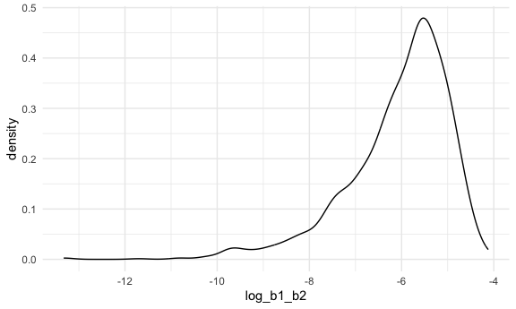
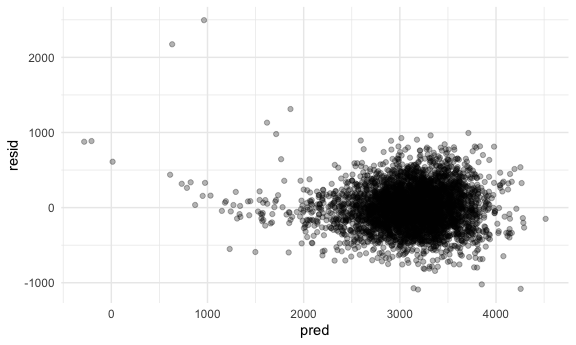
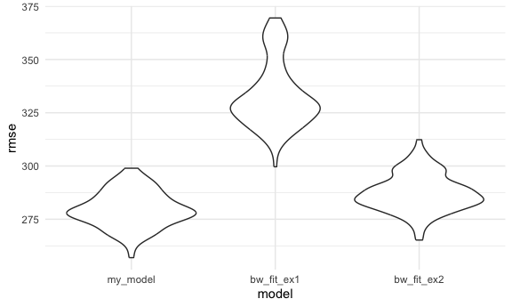

P8105 HW6
================
Courtney Diamond
2023-11-28

## Problem 1

Time to load some data.

``` r
homicide_data = 
  read_csv("data/homicide-data.csv") |> 
  mutate(city_state = str_c(as.character(city), as.character(state), sep = ", ")) |> 
  filter(!city_state %in% c('Tulsa, AL', 'Dallas, TX', 'Phoenix, AZ', 'Kansas City, MO')) |> 
  filter(victim_race %in% c('White', 'Black')) |> 
  mutate(victim_age = as.numeric(victim_age)) |> 
  mutate(status = as.numeric(disposition == 'Closed by arrest'))
```

    ## Rows: 52179 Columns: 12
    ## ── Column specification ────────────────────────────────────────────────────────
    ## Delimiter: ","
    ## chr (9): uid, victim_last, victim_first, victim_race, victim_age, victim_sex...
    ## dbl (3): reported_date, lat, lon
    ## 
    ## ℹ Use `spec()` to retrieve the full column specification for this data.
    ## ℹ Specify the column types or set `show_col_types = FALSE` to quiet this message.

``` r
homicide_data
```

    ## # A tibble: 39,693 × 14
    ##    uid        reported_date victim_last  victim_first victim_race victim_age
    ##    <chr>              <dbl> <chr>        <chr>        <chr>            <dbl>
    ##  1 Alb-000003      20100601 SATTERFIELD  VIVIANA      White               15
    ##  2 Alb-000005      20100102 MULA         VIVIAN       White               72
    ##  3 Alb-000006      20100126 BOOK         GERALDINE    White               91
    ##  4 Alb-000009      20100130 MARTIN-LEYVA GUSTAVO      White               56
    ##  5 Alb-000012      20100218 LUJAN        KEVIN        White               NA
    ##  6 Alb-000016      20100308 GRAY         STEFANIA     White               43
    ##  7 Alb-000018      20100323 DAVID        LARRY        White               52
    ##  8 Alb-000019      20100402 BRITO        ELIZABETH    White               22
    ##  9 Alb-000021      20100423 KING         TEVION       Black               15
    ## 10 Alb-000022      20100423 BOYKIN       CEDRIC       Black               25
    ## # ℹ 39,683 more rows
    ## # ℹ 8 more variables: victim_sex <chr>, city <chr>, state <chr>, lat <dbl>,
    ## #   lon <dbl>, disposition <chr>, city_state <chr>, status <dbl>

First let’s narrow down to Baltimore, MD

``` r
baltimore_homicide_df = 
  homicide_data |> 
  filter(city_state == 'Baltimore, MD')

baltimore_homicide_df
```

    ## # A tibble: 2,753 × 14
    ##    uid        reported_date victim_last victim_first  victim_race victim_age
    ##    <chr>              <dbl> <chr>       <chr>         <chr>            <dbl>
    ##  1 Bal-001607      20070101 NELSON      LEON          Black               17
    ##  2 Bal-001608      20070102 GOLF        EDDIE         Black               26
    ##  3 Bal-001609      20070105 MACKENNEY   THOMAS JOSEPH Black               21
    ##  4 Bal-001610      20070105 CANUPP      EDWARD LEE    White               61
    ##  5 Bal-001611      20070106 CUNNINGHAN  MICHAEL       Black               46
    ##  6 Bal-001612      20070106 ALSTON      RAY WILLIAM   Black               27
    ##  7 Bal-001613      20070107 HENDERSON   YULE ANTONIO  Black               21
    ##  8 Bal-001614      20070108 MCDOWELL    MARCU         Black               16
    ##  9 Bal-001615      20070108 GARDNER     RODNEY THOMAS Black               21
    ## 10 Bal-001616      20070108 BURNETTE    NELSENE       Black               44
    ## # ℹ 2,743 more rows
    ## # ℹ 8 more variables: victim_sex <chr>, city <chr>, state <chr>, lat <dbl>,
    ## #   lon <dbl>, disposition <chr>, city_state <chr>, status <dbl>

Now let’s run the glm!

``` r
baltimore_fit = 
  baltimore_homicide_df |> 
  glm(status ~ victim_age + victim_race + victim_sex, data = _, family = binomial()) |> 
  broom::tidy() |> 
  mutate(OR = exp(estimate),
         OR_CI_upper = exp(estimate + 1.96 * std.error),
         OR_CI_lower = exp(estimate - 1.96 * std.error)) |> 
  select(term, OR, OR_CI_upper, OR_CI_lower, p.value) |> 
  filter(term == 'victim_sexMale') |> 
  knitr::kable()

  
baltimore_fit
```

| term           |        OR | OR_CI_upper | OR_CI_lower | p.value |
|:---------------|----------:|------------:|------------:|--------:|
| victim_sexMale | 0.4255117 |   0.5578655 |    0.324559 |       0 |

Keeping all other variables fixed, the odds of a homicide being solved
for male victims are lower than for female victims.

Now, let’s transform this to a pipeline to do the same sort of
calculation for all the cities in the original dataset.

``` r
male_odds_solved =   
  homicide_data |> 
  nest(data = -city_state) |> 
  mutate(
    models = map(data, \(df) glm(status ~ victim_age + victim_race + victim_sex, data = df, family = binomial())),
    ) |> 
  mutate(
    tidy_models = map(models, broom::tidy)
    ) |> 
  unnest(tidy_models) |> 
  mutate(
    OR = exp(estimate),
    upper_OR_CI = exp(estimate + 1.96 * std.error),
    lower_OR_CI = exp(estimate - 1.96 * std.error)
  ) |> 
  select(city_state, term, OR, upper_OR_CI, lower_OR_CI, p.value) |> 
  filter(term == 'victim_sexMale')

male_odds_solved |> 
  knitr::kable(digits = 3)
```

| city_state         | term           |    OR | upper_OR_CI | lower_OR_CI | p.value |
|:-------------------|:---------------|------:|------------:|------------:|--------:|
| Albuquerque, NM    | victim_sexMale | 1.767 |       3.761 |       0.831 |   0.139 |
| Atlanta, GA        | victim_sexMale | 1.000 |       1.463 |       0.684 |   1.000 |
| Baltimore, MD      | victim_sexMale | 0.426 |       0.558 |       0.325 |   0.000 |
| Baton Rouge, LA    | victim_sexMale | 0.381 |       0.695 |       0.209 |   0.002 |
| Birmingham, AL     | victim_sexMale | 0.870 |       1.318 |       0.574 |   0.511 |
| Boston, MA         | victim_sexMale | 0.674 |       1.276 |       0.356 |   0.226 |
| Buffalo, NY        | victim_sexMale | 0.521 |       0.935 |       0.290 |   0.029 |
| Charlotte, NC      | victim_sexMale | 0.884 |       1.403 |       0.557 |   0.600 |
| Chicago, IL        | victim_sexMale | 0.410 |       0.501 |       0.336 |   0.000 |
| Cincinnati, OH     | victim_sexMale | 0.400 |       0.677 |       0.236 |   0.001 |
| Columbus, OH       | victim_sexMale | 0.532 |       0.750 |       0.378 |   0.000 |
| Denver, CO         | victim_sexMale | 0.479 |       0.971 |       0.236 |   0.041 |
| Detroit, MI        | victim_sexMale | 0.582 |       0.734 |       0.462 |   0.000 |
| Durham, NC         | victim_sexMale | 0.812 |       1.683 |       0.392 |   0.576 |
| Fort Worth, TX     | victim_sexMale | 0.669 |       1.127 |       0.397 |   0.131 |
| Fresno, CA         | victim_sexMale | 1.335 |       3.071 |       0.580 |   0.496 |
| Houston, TX        | victim_sexMale | 0.711 |       0.907 |       0.558 |   0.006 |
| Indianapolis, IN   | victim_sexMale | 0.919 |       1.242 |       0.679 |   0.582 |
| Jacksonville, FL   | victim_sexMale | 0.720 |       0.966 |       0.537 |   0.028 |
| Las Vegas, NV      | victim_sexMale | 0.837 |       1.154 |       0.608 |   0.278 |
| Long Beach, CA     | victim_sexMale | 0.410 |       1.082 |       0.156 |   0.072 |
| Los Angeles, CA    | victim_sexMale | 0.662 |       0.956 |       0.458 |   0.028 |
| Louisville, KY     | victim_sexMale | 0.491 |       0.790 |       0.305 |   0.003 |
| Memphis, TN        | victim_sexMale | 0.723 |       0.988 |       0.529 |   0.042 |
| Miami, FL          | victim_sexMale | 0.515 |       0.872 |       0.304 |   0.013 |
| Milwaukee, wI      | victim_sexMale | 0.727 |       1.060 |       0.499 |   0.098 |
| Minneapolis, MN    | victim_sexMale | 0.947 |       1.875 |       0.478 |   0.876 |
| Nashville, TN      | victim_sexMale | 1.034 |       1.562 |       0.685 |   0.873 |
| New Orleans, LA    | victim_sexMale | 0.585 |       0.811 |       0.422 |   0.001 |
| New York, NY       | victim_sexMale | 0.262 |       0.499 |       0.138 |   0.000 |
| Oakland, CA        | victim_sexMale | 0.563 |       0.868 |       0.365 |   0.009 |
| Oklahoma City, OK  | victim_sexMale | 0.974 |       1.520 |       0.624 |   0.908 |
| Omaha, NE          | victim_sexMale | 0.382 |       0.721 |       0.203 |   0.003 |
| Philadelphia, PA   | victim_sexMale | 0.496 |       0.652 |       0.378 |   0.000 |
| Pittsburgh, PA     | victim_sexMale | 0.431 |       0.700 |       0.265 |   0.001 |
| Richmond, VA       | victim_sexMale | 1.006 |       2.033 |       0.498 |   0.987 |
| San Antonio, TX    | victim_sexMale | 0.705 |       1.249 |       0.398 |   0.230 |
| Sacramento, CA     | victim_sexMale | 0.669 |       1.337 |       0.335 |   0.255 |
| Savannah, GA       | victim_sexMale | 0.867 |       1.780 |       0.422 |   0.697 |
| San Bernardino, CA | victim_sexMale | 0.500 |       1.462 |       0.171 |   0.206 |
| San Diego, CA      | victim_sexMale | 0.413 |       0.855 |       0.200 |   0.017 |
| San Francisco, CA  | victim_sexMale | 0.608 |       1.165 |       0.317 |   0.134 |
| St. Louis, MO      | victim_sexMale | 0.703 |       0.932 |       0.530 |   0.014 |
| Stockton, CA       | victim_sexMale | 1.352 |       2.942 |       0.621 |   0.447 |
| Tampa, FL          | victim_sexMale | 0.808 |       1.876 |       0.348 |   0.619 |
| Tulsa, OK          | victim_sexMale | 0.976 |       1.552 |       0.614 |   0.917 |
| Washington, DC     | victim_sexMale | 0.690 |       1.017 |       0.468 |   0.061 |

``` r
male_odds_solved |> 
  mutate(city_state = fct_reorder(city_state, OR)) |> 
  ggplot(aes(x = city_state, y = OR)) + 
  geom_point() + 
  geom_errorbar(aes(ymin = lower_OR_CI, ymax = upper_OR_CI)) + 
    theme(axis.text.x = element_text(angle = 60, hjust = 1))
```


Most of the cities plotted have ORs less than 1 after adjusting for race
and age, indicating smaller odds of a male victim’s homicide being
solved compared to females’. Nashville, TN, Fresno, CA, Stockton, CA,
and Albuquerque, NM have ORs greater than 1. 22 of the cities have
confidence intervals that do not include 1, indicating a statistically
significant result.

## Problem 2

First let’s load the data.

``` r
weather_df = 
  rnoaa::meteo_pull_monitors(
    c("USW00094728"),
    var = c("PRCP", "TMIN", "TMAX"), 
    date_min = "2022-01-01",
    date_max = "2022-12-31") |>
  mutate(
    name = recode(id, USW00094728 = "CentralPark_NY"),
    tmin = tmin / 10,
    tmax = tmax / 10) |>
  select(name, id, everything())
```

    ## using cached file: /Users/cjd2195/Library/Caches/org.R-project.R/R/rnoaa/noaa_ghcnd/USW00094728.dly

    ## date created (size, mb): 2023-10-05 10:29:35.021583 (8.527)

    ## file min/max dates: 1869-01-01 / 2023-10-31

``` r
weather_df
```

    ## # A tibble: 365 × 6
    ##    name           id          date        prcp  tmax  tmin
    ##    <chr>          <chr>       <date>     <dbl> <dbl> <dbl>
    ##  1 CentralPark_NY USW00094728 2022-01-01   201  13.3  10  
    ##  2 CentralPark_NY USW00094728 2022-01-02    10  15     2.8
    ##  3 CentralPark_NY USW00094728 2022-01-03     0   2.8  -5.5
    ##  4 CentralPark_NY USW00094728 2022-01-04     0   1.1  -7.1
    ##  5 CentralPark_NY USW00094728 2022-01-05    58   8.3  -0.5
    ##  6 CentralPark_NY USW00094728 2022-01-06     0   5     1.1
    ##  7 CentralPark_NY USW00094728 2022-01-07    97   1.1  -3.8
    ##  8 CentralPark_NY USW00094728 2022-01-08     0  -1    -6.6
    ##  9 CentralPark_NY USW00094728 2022-01-09    25   4.4  -1.6
    ## 10 CentralPark_NY USW00094728 2022-01-10     0   4.4  -4.3
    ## # ℹ 355 more rows

Now let’s make a quick function to actually take a single bootstrap
sample.

``` r
boot_sample = function(df) {
  
  sample_frac(df, replace = TRUE)
  
}
```

Great, now let’s build a pipeline to do this a few (thousand) times.
We’ll examine one of the strapped samples just to be safe.

``` r
boot_straps = 
  tibble(strap_number = 1:5000) |> 
  mutate(
    strap_sample = map(strap_number, \(i) boot_sample(weather_df))
  )

boot_straps |> 
  pull(strap_sample) |> 
  nth(1) |> 
  arrange(date) |> 
  head(n = 25) |> 
  knitr::kable()
```

| name           | id          | date       | prcp | tmax | tmin |
|:---------------|:------------|:-----------|-----:|-----:|-----:|
| CentralPark_NY | USW00094728 | 2022-01-01 |  201 | 13.3 | 10.0 |
| CentralPark_NY | USW00094728 | 2022-01-02 |   10 | 15.0 |  2.8 |
| CentralPark_NY | USW00094728 | 2022-01-03 |    0 |  2.8 | -5.5 |
| CentralPark_NY | USW00094728 | 2022-01-04 |    0 |  1.1 | -7.1 |
| CentralPark_NY | USW00094728 | 2022-01-04 |    0 |  1.1 | -7.1 |
| CentralPark_NY | USW00094728 | 2022-01-06 |    0 |  5.0 |  1.1 |
| CentralPark_NY | USW00094728 | 2022-01-07 |   97 |  1.1 | -3.8 |
| CentralPark_NY | USW00094728 | 2022-01-08 |    0 | -1.0 | -6.6 |
| CentralPark_NY | USW00094728 | 2022-01-08 |    0 | -1.0 | -6.6 |
| CentralPark_NY | USW00094728 | 2022-01-09 |   25 |  4.4 | -1.6 |
| CentralPark_NY | USW00094728 | 2022-01-09 |   25 |  4.4 | -1.6 |
| CentralPark_NY | USW00094728 | 2022-01-09 |   25 |  4.4 | -1.6 |
| CentralPark_NY | USW00094728 | 2022-01-10 |    0 |  4.4 | -4.3 |
| CentralPark_NY | USW00094728 | 2022-01-11 |    0 | -4.3 | -9.3 |
| CentralPark_NY | USW00094728 | 2022-01-12 |    0 |  4.4 | -6.6 |
| CentralPark_NY | USW00094728 | 2022-01-13 |    0 |  8.9 |  1.1 |
| CentralPark_NY | USW00094728 | 2022-01-14 |    0 |  6.1 | -6.0 |
| CentralPark_NY | USW00094728 | 2022-01-14 |    0 |  6.1 | -6.0 |
| CentralPark_NY | USW00094728 | 2022-01-19 |    0 |  9.4 | -2.1 |
| CentralPark_NY | USW00094728 | 2022-01-21 |    0 | -5.5 | -9.9 |
| CentralPark_NY | USW00094728 | 2022-01-23 |    5 |  2.8 | -4.3 |
| CentralPark_NY | USW00094728 | 2022-01-24 |    0 |  2.2 | -3.2 |
| CentralPark_NY | USW00094728 | 2022-01-24 |    0 |  2.2 | -3.2 |
| CentralPark_NY | USW00094728 | 2022-01-25 |    0 |  5.6 | -2.1 |
| CentralPark_NY | USW00094728 | 2022-01-25 |    0 |  5.6 | -2.1 |

Cool, for the first bootstrapped sample, even just in the first few
lines, we can see that there are many dates which were pulled more than
once (e.g. January 2, January 3, etc. etc.)

Now let’s get estimates for these two quantities for each of our
bootstrap samples.

``` r
boot_results = 
  boot_straps |> 
  mutate(
    models = map(strap_sample, \(df) lm(tmax ~ tmin + prcp, data = df)),
    results = map(models, broom::tidy)
  ) |> 
  select(strap_number, models, results) |> 
  unnest(results) |> 
  select(strap_number, models, term, estimate, std.error) |>  
  mutate(
    r2 = map(models, broom::glance)
  ) |> 
  unnest(r2)

compact_boot_results =
  boot_results |> 
  select(strap_number, models, term, estimate, r.squared) |> 
  pivot_wider(names_from = term,
              values_from = estimate) |> 
  rename(beta_0 = "(Intercept)",
         beta_1 = "tmin",
         beta_2 = "prcp") |> 
  mutate(
    log_b1_b2 = log(beta_1 * beta_2)
  )
  
compact_boot_results
```

    ## # A tibble: 5,000 × 7
    ##    strap_number models r.squared beta_0 beta_1    beta_2 log_b1_b2
    ##           <int> <list>     <dbl>  <dbl>  <dbl>     <dbl>     <dbl>
    ##  1            1 <lm>       0.921   7.95  1.01  -0.00274     NaN   
    ##  2            2 <lm>       0.932   8.14  1.02  -0.00593     NaN   
    ##  3            3 <lm>       0.908   8.13  1.02  -0.00183     NaN   
    ##  4            4 <lm>       0.932   7.94  1.03  -0.00698     NaN   
    ##  5            5 <lm>       0.924   8.40  1.02  -0.00940     NaN   
    ##  6            6 <lm>       0.909   8.00  1.01  -0.000542    NaN   
    ##  7            7 <lm>       0.942   7.23  1.06  -0.00570     NaN   
    ##  8            8 <lm>       0.919   7.97  1.01  -0.000981    NaN   
    ##  9            9 <lm>       0.897   7.81  1.01   0.00367      -5.60
    ## 10           10 <lm>       0.903   8.19  0.983  0.00716      -4.96
    ## # ℹ 4,990 more rows

Hooray! Let’s plot them. It’s important to note that, because many of
the $\hat{\beta_2}$ values calculated are negative, the
$log(\hat{\beta_1} * \hat{\beta_2})$ value is going to be `NaN` for
these samples, and thus will be dropped when plotting the distribution.

``` r
compact_boot_results |> 
  ggplot(aes(x = r.squared)) + 
  geom_density()
```


The distribution of the $\hat{r^2}$ values is negatively skewed
(i.e. the mean is less than the median value), with the mode existing
around 0.92 (ish, I am eyeballing it.)

``` r
compact_boot_results |> 
  ggplot(aes(x = log_b1_b2)) +
  geom_density()
```



The distribution of the $log(\hat{\beta_1} * \hat{\beta_2})$ values is
also negatively skewed (i.e. the mean is less than the median value),
with the mode existing around -5.5 (ish, I am eyeballing it.)

``` r
compact_boot_results |> 
  summarize(
    rsq_ci_lower = quantile(r.squared, 0.025),
    rsq_ci_upper = quantile(r.squared, 0.975),
    log_beta_ci_lower = quantile(log_b1_b2, 0.025, na.rm = TRUE),
    log_beta_ci_upper = quantile(log_b1_b2, 0.975, na.rm = TRUE)
  ) |> 
  knitr::kable(digits = 3)
```

| rsq_ci_lower | rsq_ci_upper | log_beta_ci_lower | log_beta_ci_upper |
|-------------:|-------------:|------------------:|------------------:|
|        0.888 |        0.941 |             -9.06 |            -4.579 |

The estimate of $\hat{r^2}$ is 0.9173147, 95% CI \[0.8883054,
0.9409796\]. The estimate of $log(\hat{\beta_1} * \hat{\beta_2})$ is
-6.0723757, 95% CI \[-9.0601436, -4.578678\]. As above, it’s important
to note that because the value of $log(\hat{\beta_1} * \hat{\beta_2})$
is the result of trying to take the logarithm of a negative number,
these are `NaN` and are not included when calculating the estimate and
confidence interval.

## Problem 3

Let’s read in some new data!

``` r
birthweight_df = 
  read_csv("data/birthweight.csv") |> 
  mutate(
    babysex = case_match(
    babysex,
    1 ~ "male",
    2 ~ "female"
  ),
  babysex = as.factor(babysex),
  frace = case_match(
    frace,
    1 ~ "white",
    2 ~ "black",
    3 ~ "asian",
    4 ~ "puerto rican",
    8 ~ "other",
    9 ~ "unknown"
  ),
  frace = as.factor(frace),
  malform = case_match(
    malform, 
    0 ~ "absent",
    1 ~ "present"
  ),
  malform = as.factor(malform),
  mrace = case_match(
    mrace,
    1 ~ "white",
    2 ~ "black",
    3 ~ "asian",
    4 ~ "puerto rican",
    8 ~ "other",
  ),
  mrace = as.factor(mrace))
```

    ## Rows: 4342 Columns: 20
    ## ── Column specification ────────────────────────────────────────────────────────
    ## Delimiter: ","
    ## dbl (20): babysex, bhead, blength, bwt, delwt, fincome, frace, gaweeks, malf...
    ## 
    ## ℹ Use `spec()` to retrieve the full column specification for this data.
    ## ℹ Specify the column types or set `show_col_types = FALSE` to quiet this message.

``` r
birthweight_df |> 
  summarise(across(everything(), ~ sum(is.na(.x))))
```

    ## # A tibble: 1 × 20
    ##   babysex bhead blength   bwt delwt fincome frace gaweeks malform menarche
    ##     <int> <int>   <int> <int> <int>   <int> <int>   <int>   <int>    <int>
    ## 1       0     0       0     0     0       0     0       0       0        0
    ## # ℹ 10 more variables: mheight <int>, momage <int>, mrace <int>, parity <int>,
    ## #   pnumlbw <int>, pnumsga <int>, ppbmi <int>, ppwt <int>, smoken <int>,
    ## #   wtgain <int>

``` r
birthweight_df |> 
  summarize(sga = n_distinct(pnumsga),
            lbw = n_distinct(pnumlbw))
```

    ## # A tibble: 1 × 2
    ##     sga   lbw
    ##   <int> <int>
    ## 1     1     1

``` r
bw_fit = lm(bwt ~ babysex + bhead + blength + delwt + gaweeks + mheight + parity + smoken + wtgain, data = birthweight_df)

bw_fit |> 
  broom::tidy() |> 
  mutate(sig = case_when(p.value <= 0.05 ~ TRUE))
```

    ## # A tibble: 10 × 6
    ##    term        estimate std.error statistic   p.value sig  
    ##    <chr>          <dbl>     <dbl>     <dbl>     <dbl> <lgl>
    ##  1 (Intercept) -6688.     134.       -49.9  0         TRUE 
    ##  2 babysexmale   -29.4      8.68      -3.38 7.26e-  4 TRUE 
    ##  3 bhead         136.       3.51      38.8  2.23e-283 TRUE 
    ##  4 blength        77.5      2.07      37.5  1.05e-266 TRUE 
    ##  5 delwt           1.12     0.237      4.73 2.27e-  6 TRUE 
    ##  6 gaweeks        13.9      1.50       9.29 2.31e- 20 TRUE 
    ##  7 mheight         9.60     1.79       5.37 8.32e-  8 TRUE 
    ##  8 parity         99.1     41.5        2.39 1.69e-  2 TRUE 
    ##  9 smoken         -2.38     0.579     -4.10 4.20e-  5 TRUE 
    ## 10 wtgain          2.58     0.439      5.88 4.45e-  9 TRUE

``` r
bw_df_test =
  birthweight_df |> 
  add_predictions(bw_fit) |> 
  add_residuals(bw_fit)

bw_df_test |> 
  ggplot(aes(x = pred, y = resid)) + 
  geom_point(alpha = 0.3)
```



``` r
bw_df_test |> 
  ggplot(aes(sample = resid)) +
  stat_qq() + 
  stat_qq_line()
```


``` r
bw_fit_ex1 = lm(bwt ~ blength + gaweeks, data = birthweight_df)
bw_fit_ex2 = lm(bwt ~ babysex + bhead + blength + babysex*bhead + babysex*blength + bhead*blength + babysex*bhead*blength, data = birthweight_df)

bw_fit_ex1 |> 
  broom::tidy()
```

    ## # A tibble: 3 × 5
    ##   term        estimate std.error statistic  p.value
    ##   <chr>          <dbl>     <dbl>     <dbl>    <dbl>
    ## 1 (Intercept)  -4348.      98.0      -44.4 0       
    ## 2 blength        129.       1.99      64.6 0       
    ## 3 gaweeks         27.0      1.72      15.7 2.36e-54

``` r
bw_fit_ex2 |> 
  broom::tidy()
```

    ## # A tibble: 8 × 5
    ##   term                      estimate std.error statistic    p.value
    ##   <chr>                        <dbl>     <dbl>     <dbl>      <dbl>
    ## 1 (Intercept)                -802.    1102.       -0.728 0.467     
    ## 2 babysexmale               -6375.    1678.       -3.80  0.000147  
    ## 3 bhead                       -16.6     34.1      -0.487 0.626     
    ## 4 blength                     -21.6     23.4      -0.926 0.354     
    ## 5 babysexmale:bhead           198.      51.1       3.88  0.000105  
    ## 6 babysexmale:blength         124.      35.1       3.52  0.000429  
    ## 7 bhead:blength                 3.32     0.713     4.67  0.00000317
    ## 8 babysexmale:bhead:blength    -3.88     1.06     -3.67  0.000245

``` r
bw_cv_df = 
  modelr::crossv_mc(birthweight_df, 100) |> 
  mutate(
    train = map(train, as_tibble),
    test = map(test, as_tibble))

bw_cv_df |> 
  mutate(
    my_model = map(train, \(df) lm(bwt ~ babysex + bhead + blength + delwt + gaweeks + mheight + parity + smoken + wtgain, data = birthweight_df)), 
    bw_fit_ex1 = map(train, \(df) lm(bwt ~ blength + gaweeks, data = birthweight_df)),
    bw_fit_ex2 = map(train, \(df) lm(bwt ~ babysex + bhead + blength + babysex*bhead + babysex*blength + bhead*blength + babysex*bhead*blength, data = birthweight_df))) |> 
  mutate(
    rmse_my_model = map2_dbl(my_model, test, \(mod, df) rmse(model = mod, data = df)),
    rmse_bw_fit_ex1 = map2_dbl(bw_fit_ex1, test, \(mod, df) rmse(model = mod, data = df)),
    rmse_bw_fit_ex2 = map2_dbl(bw_fit_ex2, test, \(mod, df) rmse(model = mod, data = df))
  ) |> 
  select(starts_with("rmse")) |> 
  pivot_longer(
    everything(),
    names_to = "model", 
    values_to = "rmse",
    names_prefix = "rmse_") |> 
  mutate(model = fct_inorder(model)) |> 
  ggplot(aes(x = model, y = rmse)) + geom_violin()
```


