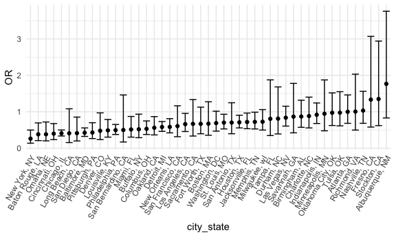

P8105 HW6
================
Courtney Diamond
2023-11-28

## Problem 1

``` r
homicide_data = 
  read_csv("data/homicide-data.csv") |> 
  mutate(city_state = str_c(as.character(city), as.character(state), sep = ", ")) |> 
  filter(!city_state %in% c('Tulsa, AL', 'Dallas, TX', 'Phoenix, AZ', 'Kansas City, MO')) |> 
  filter(victim_race %in% c('White', 'Black')) |> 
  mutate(victim_age = as.numeric(victim_age)) |> 
  mutate(status = as.numeric(disposition == 'Closed by arrest'))
```

    ## Rows: 52179 Columns: 12
    ## ── Column specification ────────────────────────────────────────────────────────
    ## Delimiter: ","
    ## chr (9): uid, victim_last, victim_first, victim_race, victim_age, victim_sex...
    ## dbl (3): reported_date, lat, lon
    ## 
    ## ℹ Use `spec()` to retrieve the full column specification for this data.
    ## ℹ Specify the column types or set `show_col_types = FALSE` to quiet this message.

    ## Warning: There was 1 warning in `mutate()`.
    ## ℹ In argument: `victim_age = as.numeric(victim_age)`.
    ## Caused by warning:
    ## ! NAs introduced by coercion

``` r
homicide_data
```

    ## # A tibble: 39,693 × 14
    ##    uid        reported_date victim_last  victim_first victim_race victim_age
    ##    <chr>              <dbl> <chr>        <chr>        <chr>            <dbl>
    ##  1 Alb-000003      20100601 SATTERFIELD  VIVIANA      White               15
    ##  2 Alb-000005      20100102 MULA         VIVIAN       White               72
    ##  3 Alb-000006      20100126 BOOK         GERALDINE    White               91
    ##  4 Alb-000009      20100130 MARTIN-LEYVA GUSTAVO      White               56
    ##  5 Alb-000012      20100218 LUJAN        KEVIN        White               NA
    ##  6 Alb-000016      20100308 GRAY         STEFANIA     White               43
    ##  7 Alb-000018      20100323 DAVID        LARRY        White               52
    ##  8 Alb-000019      20100402 BRITO        ELIZABETH    White               22
    ##  9 Alb-000021      20100423 KING         TEVION       Black               15
    ## 10 Alb-000022      20100423 BOYKIN       CEDRIC       Black               25
    ## # ℹ 39,683 more rows
    ## # ℹ 8 more variables: victim_sex <chr>, city <chr>, state <chr>, lat <dbl>,
    ## #   lon <dbl>, disposition <chr>, city_state <chr>, status <dbl>

First let’s narrow down to Baltimore, MD

``` r
baltimore_homicide_df = 
  homicide_data |> 
  filter(city_state == 'Baltimore, MD')

baltimore_homicide_df
```

    ## # A tibble: 2,753 × 14
    ##    uid        reported_date victim_last victim_first  victim_race victim_age
    ##    <chr>              <dbl> <chr>       <chr>         <chr>            <dbl>
    ##  1 Bal-001607      20070101 NELSON      LEON          Black               17
    ##  2 Bal-001608      20070102 GOLF        EDDIE         Black               26
    ##  3 Bal-001609      20070105 MACKENNEY   THOMAS JOSEPH Black               21
    ##  4 Bal-001610      20070105 CANUPP      EDWARD LEE    White               61
    ##  5 Bal-001611      20070106 CUNNINGHAN  MICHAEL       Black               46
    ##  6 Bal-001612      20070106 ALSTON      RAY WILLIAM   Black               27
    ##  7 Bal-001613      20070107 HENDERSON   YULE ANTONIO  Black               21
    ##  8 Bal-001614      20070108 MCDOWELL    MARCU         Black               16
    ##  9 Bal-001615      20070108 GARDNER     RODNEY THOMAS Black               21
    ## 10 Bal-001616      20070108 BURNETTE    NELSENE       Black               44
    ## # ℹ 2,743 more rows
    ## # ℹ 8 more variables: victim_sex <chr>, city <chr>, state <chr>, lat <dbl>,
    ## #   lon <dbl>, disposition <chr>, city_state <chr>, status <dbl>

Now let’s run the glm!

``` r
baltimore_fit = 
  baltimore_homicide_df |> 
  glm(status ~ victim_age + victim_race + victim_sex, data = _, family = binomial()) |> 
  broom::tidy() |> 
  mutate(OR = exp(estimate),
         OR_CI_upper = exp(estimate + 1.96 * std.error),
         OR_CI_lower = exp(estimate - 1.96 * std.error)) |> 
  select(term, OR, OR_CI_upper, OR_CI_lower, p.value) |> 
  filter(term == 'victim_sexMale') |> 
  knitr::kable()

  
baltimore_fit
```

| term           |        OR | OR_CI_upper | OR_CI_lower | p.value |
|:---------------|----------:|------------:|------------:|--------:|
| victim_sexMale | 0.4255117 |   0.5578655 |    0.324559 |       0 |

Keeping all other variables fixed, the odds of a homicide being solved
for male victims are lower than for female victims.

Now, let’s transform this to a pipeline to do the same sort of
calculation for all the cities in the original dataset.

``` r
male_odds_solved =   
  homicide_data |> 
  nest(data = -city_state) |> 
  mutate(
    models = map(data, \(df) glm(status ~ victim_age + victim_race + victim_sex, data = df, family = binomial())),
    ) |> 
  mutate(
    tidy_models = map(models, broom::tidy)
    ) |> 
  unnest(tidy_models) |> 
  mutate(
    OR = exp(estimate),
    upper_OR_CI = exp(estimate + 1.96 * std.error),
    lower_OR_CI = exp(estimate - 1.96 * std.error)
  ) |> 
  select(city_state, term, OR, upper_OR_CI, lower_OR_CI, p.value) |> 
  filter(term == 'victim_sexMale')

male_odds_solved |> 
  knitr::kable(digits = 3)
```

| city_state         | term           |    OR | upper_OR_CI | lower_OR_CI | p.value |
|:-------------------|:---------------|------:|------------:|------------:|--------:|
| Albuquerque, NM    | victim_sexMale | 1.767 |       3.761 |       0.831 |   0.139 |
| Atlanta, GA        | victim_sexMale | 1.000 |       1.463 |       0.684 |   1.000 |
| Baltimore, MD      | victim_sexMale | 0.426 |       0.558 |       0.325 |   0.000 |
| Baton Rouge, LA    | victim_sexMale | 0.381 |       0.695 |       0.209 |   0.002 |
| Birmingham, AL     | victim_sexMale | 0.870 |       1.318 |       0.574 |   0.511 |
| Boston, MA         | victim_sexMale | 0.674 |       1.276 |       0.356 |   0.226 |
| Buffalo, NY        | victim_sexMale | 0.521 |       0.935 |       0.290 |   0.029 |
| Charlotte, NC      | victim_sexMale | 0.884 |       1.403 |       0.557 |   0.600 |
| Chicago, IL        | victim_sexMale | 0.410 |       0.501 |       0.336 |   0.000 |
| Cincinnati, OH     | victim_sexMale | 0.400 |       0.677 |       0.236 |   0.001 |
| Columbus, OH       | victim_sexMale | 0.532 |       0.750 |       0.378 |   0.000 |
| Denver, CO         | victim_sexMale | 0.479 |       0.971 |       0.236 |   0.041 |
| Detroit, MI        | victim_sexMale | 0.582 |       0.734 |       0.462 |   0.000 |
| Durham, NC         | victim_sexMale | 0.812 |       1.683 |       0.392 |   0.576 |
| Fort Worth, TX     | victim_sexMale | 0.669 |       1.127 |       0.397 |   0.131 |
| Fresno, CA         | victim_sexMale | 1.335 |       3.071 |       0.580 |   0.496 |
| Houston, TX        | victim_sexMale | 0.711 |       0.907 |       0.558 |   0.006 |
| Indianapolis, IN   | victim_sexMale | 0.919 |       1.242 |       0.679 |   0.582 |
| Jacksonville, FL   | victim_sexMale | 0.720 |       0.966 |       0.537 |   0.028 |
| Las Vegas, NV      | victim_sexMale | 0.837 |       1.154 |       0.608 |   0.278 |
| Long Beach, CA     | victim_sexMale | 0.410 |       1.082 |       0.156 |   0.072 |
| Los Angeles, CA    | victim_sexMale | 0.662 |       0.956 |       0.458 |   0.028 |
| Louisville, KY     | victim_sexMale | 0.491 |       0.790 |       0.305 |   0.003 |
| Memphis, TN        | victim_sexMale | 0.723 |       0.988 |       0.529 |   0.042 |
| Miami, FL          | victim_sexMale | 0.515 |       0.872 |       0.304 |   0.013 |
| Milwaukee, wI      | victim_sexMale | 0.727 |       1.060 |       0.499 |   0.098 |
| Minneapolis, MN    | victim_sexMale | 0.947 |       1.875 |       0.478 |   0.876 |
| Nashville, TN      | victim_sexMale | 1.034 |       1.562 |       0.685 |   0.873 |
| New Orleans, LA    | victim_sexMale | 0.585 |       0.811 |       0.422 |   0.001 |
| New York, NY       | victim_sexMale | 0.262 |       0.499 |       0.138 |   0.000 |
| Oakland, CA        | victim_sexMale | 0.563 |       0.868 |       0.365 |   0.009 |
| Oklahoma City, OK  | victim_sexMale | 0.974 |       1.520 |       0.624 |   0.908 |
| Omaha, NE          | victim_sexMale | 0.382 |       0.721 |       0.203 |   0.003 |
| Philadelphia, PA   | victim_sexMale | 0.496 |       0.652 |       0.378 |   0.000 |
| Pittsburgh, PA     | victim_sexMale | 0.431 |       0.700 |       0.265 |   0.001 |
| Richmond, VA       | victim_sexMale | 1.006 |       2.033 |       0.498 |   0.987 |
| San Antonio, TX    | victim_sexMale | 0.705 |       1.249 |       0.398 |   0.230 |
| Sacramento, CA     | victim_sexMale | 0.669 |       1.337 |       0.335 |   0.255 |
| Savannah, GA       | victim_sexMale | 0.867 |       1.780 |       0.422 |   0.697 |
| San Bernardino, CA | victim_sexMale | 0.500 |       1.462 |       0.171 |   0.206 |
| San Diego, CA      | victim_sexMale | 0.413 |       0.855 |       0.200 |   0.017 |
| San Francisco, CA  | victim_sexMale | 0.608 |       1.165 |       0.317 |   0.134 |
| St. Louis, MO      | victim_sexMale | 0.703 |       0.932 |       0.530 |   0.014 |
| Stockton, CA       | victim_sexMale | 1.352 |       2.942 |       0.621 |   0.447 |
| Tampa, FL          | victim_sexMale | 0.808 |       1.876 |       0.348 |   0.619 |
| Tulsa, OK          | victim_sexMale | 0.976 |       1.552 |       0.614 |   0.917 |
| Washington, DC     | victim_sexMale | 0.690 |       1.017 |       0.468 |   0.061 |

``` r
male_odds_solved |> 
  mutate(city_state = fct_reorder(city_state, OR)) |> 
  ggplot(aes(x = city_state, y = OR)) + 
  geom_point() + 
  geom_errorbar(aes(ymin = lower_OR_CI, ymax = upper_OR_CI)) + 
    theme(axis.text.x = element_text(angle = 60, hjust = 1))
```



Most of the cities plotted have ORs less than 1 after adjusting for race
and age, indicating smaller odds of a male victim’s homicide being
solved compared to females’. Nashville, TN, Fresno, CA, Stockton, CA,
and Albuquerque, NM have ORs greater than 1. 22 of the cities have
confidence intervals that do not include 1, indicating a statistically
significant result.

## Problem 2

``` r
weather_df = 
  rnoaa::meteo_pull_monitors(
    c("USW00094728"),
    var = c("PRCP", "TMIN", "TMAX"), 
    date_min = "2022-01-01",
    date_max = "2022-12-31") |>
  mutate(
    name = recode(id, USW00094728 = "CentralPark_NY"),
    tmin = tmin / 10,
    tmax = tmax / 10) |>
  select(name, id, everything())
```

    ## using cached file: /Users/cjd2195/Library/Caches/org.R-project.R/R/rnoaa/noaa_ghcnd/USW00094728.dly

    ## date created (size, mb): 2023-10-05 10:29:35.021583 (8.527)

    ## file min/max dates: 1869-01-01 / 2023-10-31
